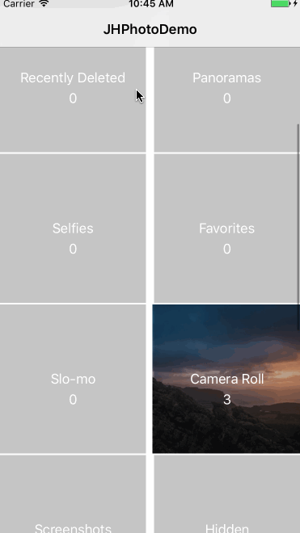

# JHPhoto — An iOS Photo Browser Demo

    

## Description

利用 PhotoKit（iOS 9.0+）封装的图片框架，并带有使用 Demo。

## Latest Update

* Support view all ablum 
* Support view origin photo
* Support Photo Bowser
* Support Gesture

## TODO List

- [ ] 支持 gif, 视频和 live photo
- [ ] 强化 demo 中的 viewController
- [ ] 查看图片更多信息

